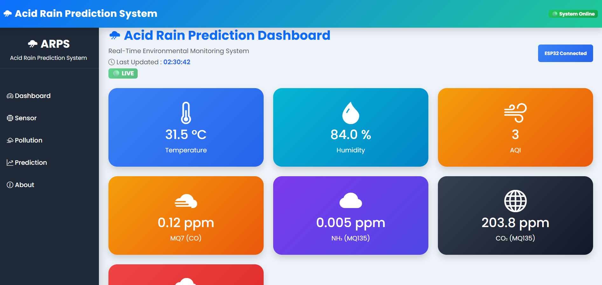
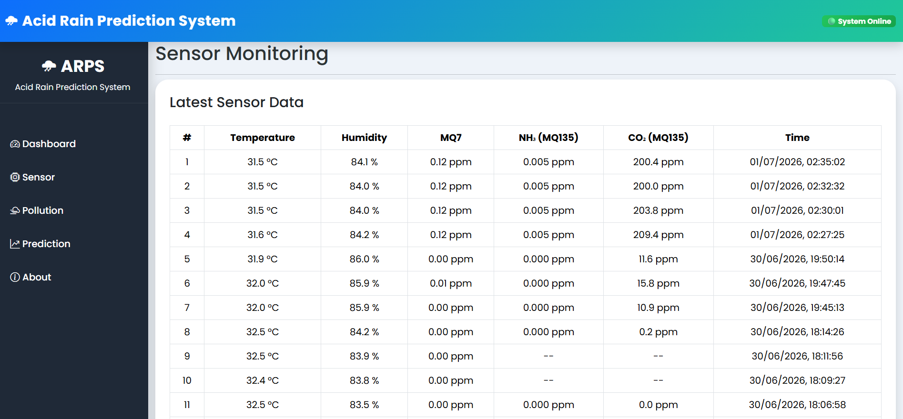
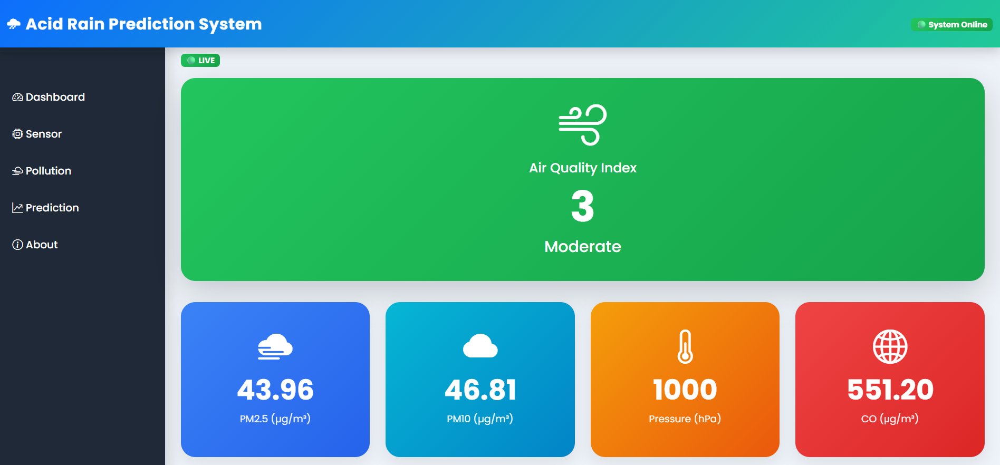
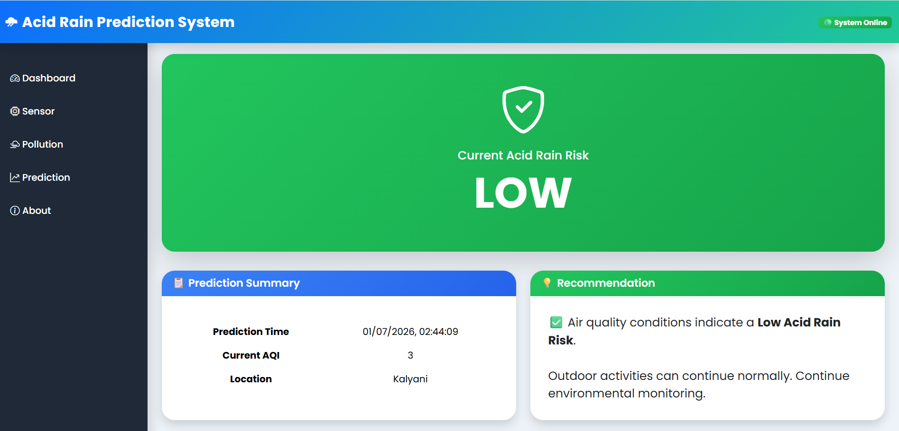
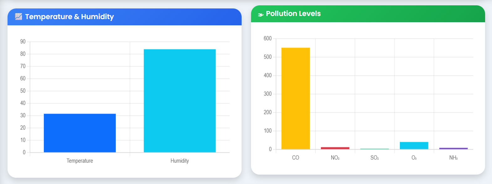
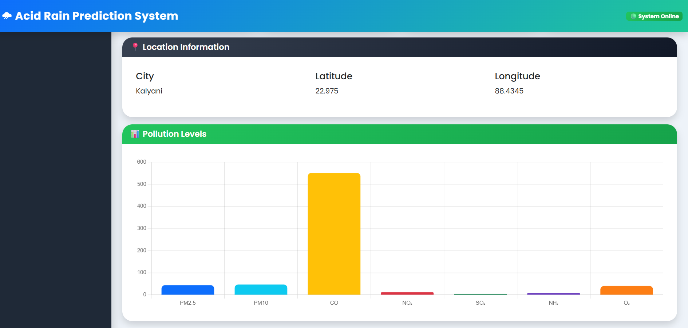
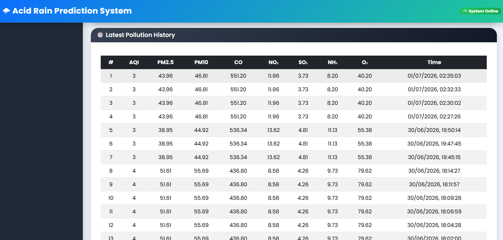

# 🌧️ Acid Rain Prediction System


An IoT-enabled Machine Learning Framework for **Real-Time Pollutant Monitoring and Acid Rain Risk Estimation**.

Developed as the MCA Major Project at **Kalyani Government Engineering College**.

---

# 📌 Project Overview

This project integrates **IoT**, **Machine Learning**, **Cloud Database**, and **Environmental APIs** to build a real-time Acid Rain Prediction System.

The ESP32 continuously collects environmental data from multiple sensors and transmits it to a Flask backend. The backend combines sensor data with live pollutant information from the OpenWeather Air Pollution API, stores the data in InfluxDB, and predicts the acid rain risk using an XGBoost Machine Learning model.

---

# 🚀 Key Features

- 🌡️ Real-Time Temperature & Humidity Monitoring
- ☁️ CO, NH₃ & CO₂ Monitoring
- 🌍 Live Air Pollution API Integration
- 📊 Interactive Dashboard
- 📈 Historical Data Storage
- 🤖 XGBoost Machine Learning Prediction
- 🌧️ Acid Rain Risk Classification
- 📡 REST API Backend
- ☁️ InfluxDB Time-Series Database

---

# 🛠 Technologies Used

## Programming Languages

- Python
- C++
- HTML
- CSS
- JavaScript

## Backend

- Flask
- REST API

## Machine Learning

- XGBoost
- Scikit-Learn
- Pandas
- NumPy
- Joblib

## Database

- InfluxDB

## Frontend

- HTML
- CSS
- JavaScript
- Chart.js

## IoT Hardware

- ESP32 DevKit
- DHT22
- MQ135
- MQ7

## External APIs

- OpenWeather Air Pollution API

---

# 🏗️ System Architecture

```
ESP32 Sensors
      │
      ▼
 Flask Backend
      │
      ├──────────────► OpenWeather API
      │
      ▼
   InfluxDB
      │
      ▼
XGBoost ML Model
      │
      ▼
 Web Dashboard
```

---

# 📂 Project Structure

```
Acid-Rain-Prediction/
│
├── database/
├── ml/
├── routes/
├── services/
├── static/
├── templates/
├── tests/
├── utils/
│
├── app.py
├── config.py
├── device_config.py
├── requirements.txt
├── README.md
└── .gitignore
```

---

# 📊 Machine Learning

## Input Features

- Temperature
- Humidity
- Pressure
- PM2.5
- PM10
- SO₂
- NO₂
- NH₃
- CO
- O₃

## Output

- 🟢 Low Risk
- 🟡 Medium Risk
- 🔴 High Risk

### Model

**XGBoost Classifier**

Training Accuracy

> **99.46%**

Testing Accuracy

> **96.84%**

---

# 📷 Dashboard Screenshots

## 🏠 Dashboard



---

## 🌡️ Real-Time Sensor Monitoring



---

## 🌍 Live Pollution Data



---

## 🌧️ Acid Rain Prediction



---

## 📊 Sensor Analytics



---

## 📈 Pollution Analytics


---

## 🗂 Prediction History



---

## 🗄 Pollution History



---

# ⚙️ Installation

Clone Repository

```bash
git clone https://github.com/YOUR_USERNAME/Acid-Rain-Prediction.git
```

Go into project

```bash
cd Acid-Rain-Prediction
```

Create virtual environment

```bash
python -m venv .venv
```

Activate

Windows

```bash
.venv\Scripts\activate
```

Linux/Mac

```bash
source .venv/bin/activate
```

Install dependencies

```bash
pip install -r requirements.txt
```

Create `.env`

```text
OPENWEATHER_API_KEY=

INFLUXDB_URL=

INFLUXDB_TOKEN=

INFLUXDB_ORG=

INFLUXDB_BUCKET=
```

Run

```bash
python app.py
```

---

# 📊 Dataset

- CPCB Historical Air Quality Dataset
- OpenWeather Air Pollution API
- ESP32 Real-Time Sensor Data

---

# 🔮 Future Scope

- Mobile Application
- MQTT Integration
- Multiple IoT Nodes
- Cloud Deployment
- SMS & Email Alerts
- GIS Mapping
- Deep Learning Models
- Solar Powered IoT Station

---

# 👨‍💻 Team

- **Pranab Porel**
- Arnab Sen
- Himale Chatterjee
- Biswajit Sardar

---

## Supervisor

**Mr. Tanmoy Roy**

Department of Computer Application

Kalyani Government Engineering College

---

# 📜 License

This project was developed for academic and research purposes as part of the MCA Major Project.
